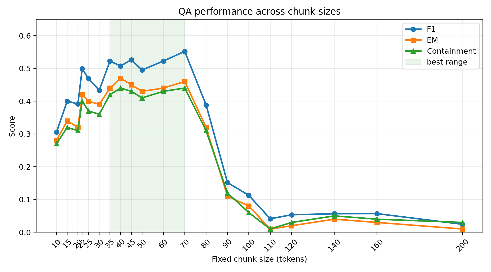
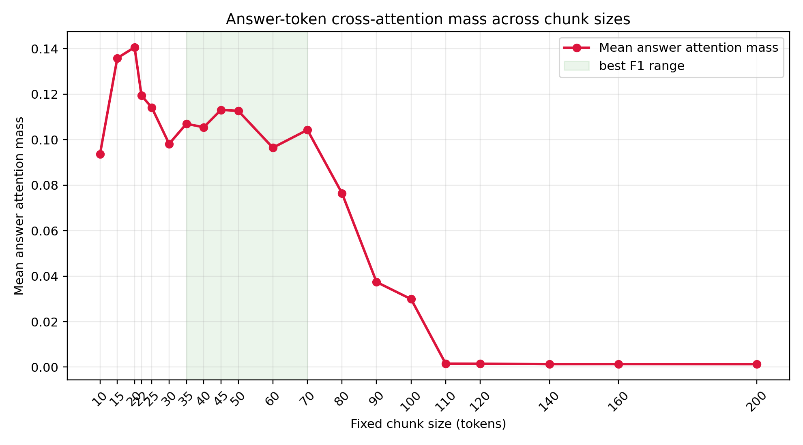
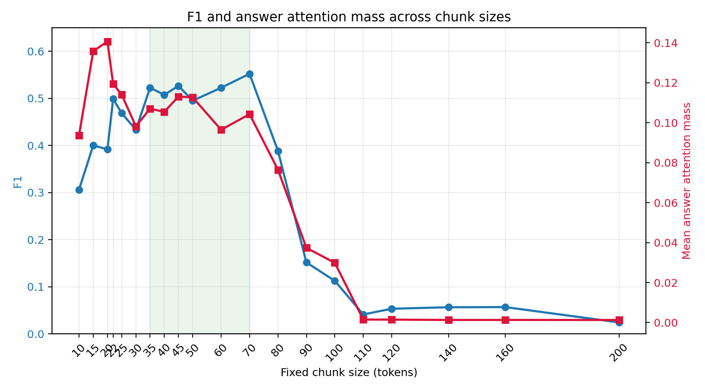

# Chunk Size Diagnostics Summary

This note summarizes the additional chunk-size ablation and generator attention diagnostics run on the same SQuAD validation setup used in the project experiments.

## Experimental Setup

- Dataset: SQuAD validation subset
- QA file: `data/qa/squad_validation_qa_2000_rerun_rtmeta_20260420_150724.json`
- Corpus file: `data/corpus/squad_validation_corpus_2000_rerun_rtmeta_20260420_150724.json`
- Retriever: BM25
- Generator: `google/flan-t5-base`
- Top-k: 5
- Questions: first 100 examples
- Chunking: fixed-size chunks with approximately 20% overlap

## Chunk Size Ablation

| Chunk size | EM | F1 | Containment |
|---:|---:|---:|---:|
| 10 | 0.280 | 0.306 | 0.270 |
| 15 | 0.340 | 0.400 | 0.320 |
| 20 | 0.320 | 0.392 | 0.310 |
| 22 | 0.420 | 0.499 | 0.400 |
| 25 | 0.400 | 0.469 | 0.370 |
| 30 | 0.390 | 0.433 | 0.360 |
| 35 | 0.440 | 0.522 | 0.420 |
| 40 | 0.470 | 0.507 | 0.440 |
| 45 | 0.450 | 0.526 | 0.430 |
| 50 | 0.430 | 0.495 | 0.410 |
| 60 | 0.440 | 0.522 | 0.430 |
| 70 | 0.460 | 0.552 | 0.440 |
| 80 | 0.320 | 0.388 | 0.310 |
| 90 | 0.110 | 0.152 | 0.120 |
| 100 | 0.080 | 0.113 | 0.060 |
| 110 | 0.010 | 0.041 | 0.010 |
| 120 | 0.020 | 0.053 | 0.030 |
| 140 | 0.040 | 0.057 | 0.050 |
| 160 | 0.030 | 0.057 | 0.040 |
| 200 | 0.010 | 0.024 | 0.030 |

The strongest F1 score occurs at chunk size 70, while the strongest EM score occurs at chunk size 40. The stable high-performing region is roughly 35-70 tokens. Performance drops sharply after chunk size 90, suggesting that long chunks introduce substantial distracting context for the generator.

## Generator Cross-Attention Diagnostic

For each chunk size, cross-attention was computed on the same five representative questions: 7, 15, 31, 59, and 83. The diagnostic measures the mean decoder-to-encoder cross-attention mass assigned to gold-answer tokens in the retrieved context.

| Chunk size | Mean answer attention mass | Median answer attention mass |
|---:|---:|---:|
| 10 | 0.093600 | 0.138277 |
| 15 | 0.135822 | 0.153472 |
| 20 | 0.140579 | 0.150147 |
| 22 | 0.119366 | 0.127225 |
| 25 | 0.114043 | 0.120956 |
| 30 | 0.098142 | 0.097462 |
| 35 | 0.106976 | 0.121896 |
| 40 | 0.105420 | 0.127874 |
| 45 | 0.113083 | 0.114365 |
| 50 | 0.112640 | 0.119949 |
| 60 | 0.096439 | 0.088152 |
| 70 | 0.104269 | 0.132573 |
| 80 | 0.076454 | 0.066558 |
| 90 | 0.037397 | 0.003429 |
| 100 | 0.029881 | 0.001481 |
| 110 | 0.001514 | 0.000777 |
| 120 | 0.001474 | 0.000529 |
| 140 | 0.001302 | 0.000771 |
| 160 | 0.001310 | 0.000771 |
| 200 | 0.001290 | 0.000746 |

Across these chunk sizes, mean answer attention mass is strongly correlated with QA performance:

- Correlation with F1: 0.924
- Correlation with EM: 0.924

These results suggest that chunk size affects not only retrieval granularity, but also the generator's ability to focus on answer-bearing evidence. We treat attention as a diagnostic signal rather than a definitive causal explanation.

